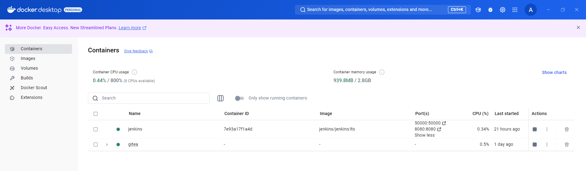

## Deploying Gitea and Jenkins

### Gitea Deployment
1. **Create a Docker network:**
   The purpose of creating a custom Docker network, `devops_network`, is to enable seamless communication between Jenkins and Gitea containers. This isolated network ensures better security and container discovery by name.

   ```bash
   docker network create devops_network
   ```

2. **Run Gitea:**
   ```bash
   docker run -d \
     --name=gitea \
     --network=devops_network \
     -p 3000:3000 -p 2222:22 \
     gitea/gitea:latest
   ```

3. **Access Gitea:**
   Open [http://localhost:3000](http://localhost:3000) in your browser and configure the instance.

### Jenkins Deployment
1. **Run Jenkins:**
   ```bash
   docker run -d \
     --name=jenkins \
     --network=devops_network \
     -p 8080:8080 -p 50000:50000 \
     -v jenkins_home:/var/jenkins_home \
     -v /var/run/docker.sock:/var/run/docker.sock \
     jenkins/jenkins:lts
   ```

2. **Access Jenkins:**
   Open [http://localhost:8080](http://localhost:8080) and configure the instance with the initial admin password from the container logs:
   ```bash
   docker logs jenkins
   ```

---

### Docker Containers
Running Docker containers during deployment:


---

